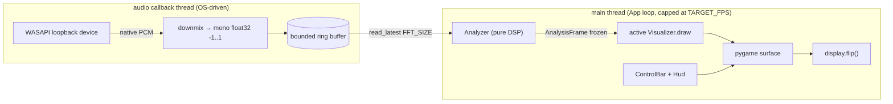
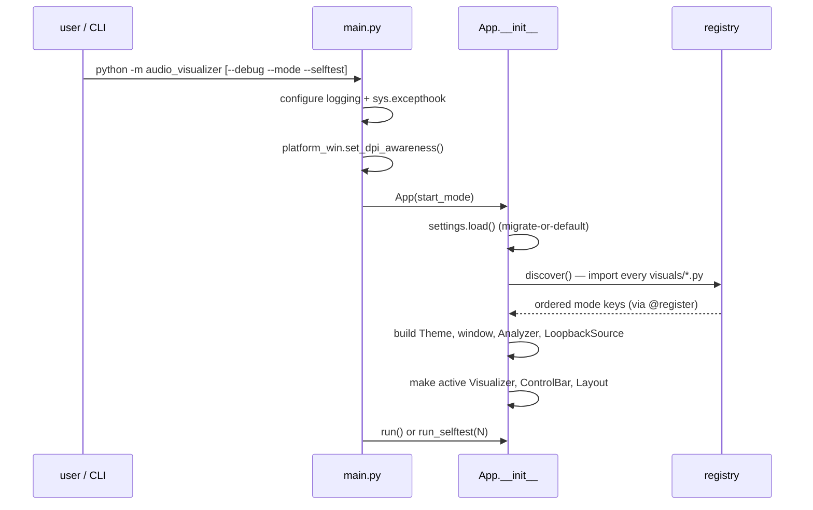
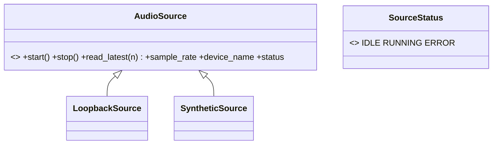
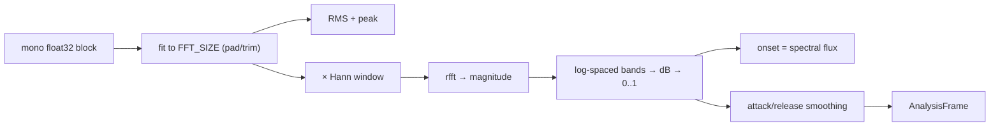
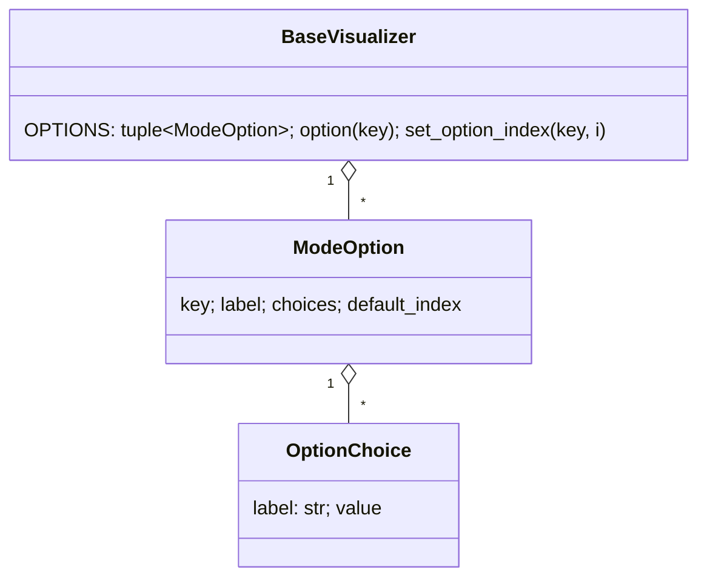

# Architecture & Code Flow

The **detailed "how it works"** companion to the planning docs. Where
`repository-and-code-layout.md` says *what each file is*, this file explains
*how the pieces run together at runtime* — the frameworks, the per-frame flow,
the threading model, and the conventions a maintainer needs before touching code.

**Related:** `audio-visualizer-plan.md` (vision + decisions §8) ·
`repository-and-code-layout.md` (file tree + responsibilities) ·
`development-phases.md` (per-phase work order) · `testing.md` (test strategy).

---

## 1. The 10,000-foot view

A single-window Windows app that captures whatever the system is playing
(WASAPI loopback), turns that audio into a normalized, smoothed snapshot, and
hands that snapshot to one pluggable **visual mode** per frame. Everything is
synchronous on the main thread except the audio device callback.



Three boundaries keep the design clean and testable:

1. **`AudioSource`** — the only way audio enters the app. Real audio is
   `LoopbackSource`; tests/CI/`--selftest` use `SyntheticSource`. Nothing above
   this line imports `pyaudiowpatch`.
2. **`AnalysisFrame`** — an immutable snapshot. The DSP produces it; visuals only
   read it. It is the entire contract between "audio world" and "visual world".
3. **`BaseVisualizer` + registry** — modes are plugins discovered at startup. A
   mode sees only its `AnalysisFrame`, the `surface`, `dt`, and the shared `Theme`.

---

## 2. Startup flow



Key points:

- **`registry.discover()`** walks the `visuals/` package with `pkgutil` and imports
  every module whose name does not start with `_` (and isn't `base`/`registry`).
  Importing a module runs its `@register(...)` decorator, which records the class.
  This is why **adding a mode is one new file** — no list to edit.
- **Settings load never crashes.** A missing/corrupt/old `settings.json` falls back
  to defaults (see `settings.py`, `schema_version`). All loaded numbers are clamped
  to their config min/max in `App.__init__`.
- The **one `Theme` instance** built here is shared by reference with every visual
  (`_make_visual` assigns `visual.theme = self._theme`), so size/speed/color/phase
  changes apply instantly to the live mode without re-instantiation.

---

## 3. The per-frame loop

`App.run()` is the heartbeat. Each iteration:

```text
dt = clock.tick(TARGET_FPS) / 1000      # real elapsed seconds, FPS-capped
_handle_events()                        # input, resize, fullscreen, notice dismiss
_update(dt)                             # pull samples → analyze → sensitivity scale
_draw(dt)                               # advance hue, draw canvas + UI + HUD
pygame.display.flip()
```

### 3.1 `_update(dt)` — audio → frame

1. If not capturing, do nothing (`self._frame` stays as-is / None).
2. If the source reports `ERROR`, run `_attempt_recovery(dt)` (periodic re-open on a
   `DEVICE_RECOVER_INTERVAL` timer) and set `frame = None`.
3. Otherwise `read_latest(FFT_SIZE)` from the ring buffer. `None` means "no data yet"
   → `frame = None` (idle), not an error.
4. `Analyzer.analyze(samples, sample_rate)` returns a fresh `AnalysisFrame`.
5. If sensitivity ≠ 1.0, the band energies are scaled and re-clamped via
   `dataclasses.replace` (the frame stays immutable — we make a new one).

### 3.2 `_draw(dt)` — frame → pixels

1. Clear to `COLOR_BG`.
2. Advance `Theme.color_phase` by `dt * COLOR_CYCLE_RATE` (mod 1.0) so **Rainbow+**
   cycles hue over time.
3. Update `_silent_seconds` (incremented while capturing + silent, else reset to 0).
   The idle banner shows only after `IDLE_BANNER_DELAY`, so brief track gaps don't
   flash it — and silence **never** auto-quits.
4. Draw the active visual into a **subsurface** of the canvas rect, then draw the
   **RenK logo overlay** (`RenkLogo`) into the same subsurface so it sits over every
   mode. The whole block is wrapped in `try/except` → a broken mode/overlay is logged
   and fail-soft, never fatal.
5. Draw the control bar (windowed only), the HUD status line, and — before strobing
   modes, until acknowledged — the one-time photosensitivity notice.
6. Draw any open **modal** last (the `RenK` logo-settings panel or the `About` dialog)
   so it sits above the canvas, controls, and HUD.

> **RenK logo overlay (Phase 9).** `visuals/logo.py` `RenkLogo` is a global overlay, not
> a `@register`ed mode: the App owns one instance and draws it after the active mode. It
> reads the shared `Theme`/`AnalysisFrame`, spins (faster on bass), pulses with energy,
> and optionally emits sparks via a `SparkField`. It composites **additively** so the
> neon-on-black art glows with no bounding box; "Rainbow+" tints a luminance copy of the
> art with the cycling hue. Show/color/transparency/size/position/emit are persisted
> (`logo_*`, settings schema v2). **`Esc` closes a modal or exits fullscreen — it never
> quits** (quit = `Quit` button / `Ctrl+Q`).

### 3.3 `dt`, speed, and lifetimes

`dt` is real wall-clock seconds. Motion that should honor the **Speed** control
multiplies `dt` by `theme.speed_scale` (call it `move_dt`); particle **lifetimes**
use raw `dt` so "calm" speed doesn't make sparks live forever. This split is applied
consistently across the particle/flake modes.

---

## 4. Audio capture framework (`audio/`)



- **`LoopbackSource`** opens the default render device's **loopback** stream with
  `pyaudiowpatch`, negotiating the device's **native** sample rate / channels / dtype.
  The device callback is tiny and allocation-light: it downmixes to **mono float32
  in -1..1** and writes into a **bounded ring buffer**. The main loop pulls the most
  recent `FFT_SIZE` samples with `read_latest`.
- **Silence vs error are distinct.** Loopback often delivers silence (or no callback)
  when nothing is playing — that is the *idle* state (`frame.is_silent`), not an error.
  Device-not-found / open failure / device change set `SourceStatus.ERROR`, which
  surfaces the on-screen banner while the app keeps running and retries.
- **`SyntheticSource`** generates a sine/sweep/silence tone at a chosen sample rate.
  It is what makes the DSP and the whole app testable headlessly and in CI.

---

## 5. DSP framework (`audio/analysis.py`)

Pure functions of (samples, sample_rate) → `AnalysisFrame`. No pygame, no I/O.



- **Band mapping** is built once per sample rate (`_ensure_band_map`): `BAND_COUNT`
  log-spaced edges between `MIN_HZ` and `MAX_HZ`, each band owning ≥1 FFT bin.
- **Normalization**: magnitudes go to dB, then the `_DB_FLOOR..0 dB` range maps to
  `0..1` (clamped). Silence is guarded with `_EPS` so all-zero input never yields NaN.
- **Smoothing** is per-band attack/release: rising values use the (fast) `attack`
  coefficient, falling values the (slow) `release`. The UI **Smoothing** slider maps
  `0..1` onto these coefficients in `App._smoothing_to_coeffs` using the
  `SMOOTHING_*_AT_0/AT_1` config endpoints.
- **Onset** is summed positive spectral flux since the previous frame (×`ONSET_FLUX_GAIN`,
  clamped) — the trigger particle modes use to spawn bursts.

`AnalysisFrame` (`audio/frame.py`) is a **frozen** dataclass: `waveform_mono`,
`band_energies` (0..1), `rms`, `peak`, `sample_rate`, `timestamp`, `onset`, plus the
`is_silent` helper. Frozen so it can be shared/queued without aliasing surprises.

---

## 6. Visual framework (`visuals/`)

### 6.1 The contract

Every mode subclasses `BaseVisualizer` and implements **one** required method:

```python
def draw(self, surface: pygame.Surface, frame: AnalysisFrame | None, dt: float) -> None: ...
```

Provided by the base (override only as needed): `on_enter()`, `on_exit()`,
`on_resize(size)`, the `reduce_motion` flag, the shared `theme`, and the per-mode
**options** accessors (`option`, `option_index`, `set_option_index`). Class metadata
`KEY` / `DISPLAY_NAME` / `ORDER` is set by `@register`.

A mode's only inputs are the read-only `frame`, the `surface` (it derives all layout
from `surface.get_size()` each frame — no hard-coded pixels), `dt`, and the shared
`theme`. It must not touch capture, other modes, or global state.

### 6.2 Registration & discovery

```python
@register(key="waveform_circle", display_name="Waveform Circle", order=16)
class WaveformCircle(BaseVisualizer):
    ...
```

`order` controls position in the cycle / picker; `key` is the stable identity used by
settings, `--mode`, and the dropdown. `registry.discover()` imports all modes at
startup; `registry.keys()/options()/create()` drive the App.

### 6.3 The shared `Theme`

```python
@dataclass
class Theme:
    size_scale: float      # F5/F6 — particle/flake/line sizes
    speed_scale: float     # F7/F8 — animation speed (× dt for motion)
    color_scheme: str      # C / dropdown — classic | rainbow | rainbow_plus
    color_phase: float     # advanced each frame; drives Rainbow+ cycling
```

One instance, shared by reference (see §2). Colors flow through `_helpers.themed_color(
scheme, t, palette, phase)`, where `rainbow_color` wraps hue with `t % 1.0` **before**
clamping so Rainbow+ is seamless.

### 6.4 Per-mode options



A mode declares `OPTIONS = (_SIZE, _THICKNESS, ...)`; it reads the live value with
`self.option("size")`. On a mode switch, `App._refresh_mode_options()` rebuilds the
bottom-row dropdowns from the new mode's `OPTIONS`, and dropdown changes call
`set_option_index`. Adding an option is still **one file** — no central list.

**Presets (v00.0A.07):** a mode may declare a `PRESETS` dict mapping a leading `preset`
option's choice index → a `{option_key: choice_index}` combo. `BaseVisualizer.on_option_change`
applies the combo when `preset` changes (and snaps `preset` back to "Custom" when the user
edits another option). Subclasses overriding `on_option_change` must call `super()` —
`Particles`, for example, also clears the inactive pool when its `emitter`/`preset` changes.

### 6.5 Shared draw helpers (`visuals/_helpers.py`)

Underscore prefix → **skipped by discovery**, so this is the home for reusable
primitives (importing it from a mode is fine; importing one mode from another is not):

- **Color:** `lerp_color`, `palette_color`, `scale_color`, `rainbow_color`, `themed_color`.
- **Spectrum slicing:** `range_energies(bands, slices)` — the mean energy of each of
  `slices` equal sub-ranges, used by Waveform Rings' multi-ring layout.
- **Circular waveforms:** `ring_points`, `draw_ring`, and the reusable `RingPops`
  pop-particle field (used by the Waveform Rings mode).
- **Free particles:** `SparkField` — a reusable particle system in normalized (0..1)
  space with an optional fading "shadow" trail, plus the shared `TRAIL_OPTION`. Used by
  the beam modes (`lightshow`, `laser`) for "shot out" / "emitted" particles.
- **Shared option axes:** `PARTICLES_OPTION` (Off/Sparse/Dense), `MIRROR_OPTION`,
  `GLOW_OPTION`, `COLOR_OPTION`, `THICKNESS_OPTION`, `SPEED_OPTION` — reused across modes
  so a "+particles" or "+mirror" variant is an option, not a separate mode.

### 6.6 The modes (19)

Consolidated in v00.0A.07 (26 → 19): paired/family modes were merged behind options
(see `plan/phase-0a07-mode-consolidation.md`). The registry (each class's
`@register(key, display_name, order)`) is the single source of truth.

| Order | Key | Display | Notes |
|------:|-----|---------|-------|
| 10 | `waveform` | Waveform | oscilloscope line; Particles / Mirror options |
| 16 | `waveform_circle` | Waveform Rings | ring(s) wrapped from the wave; Rings 1/3/6/12 + Particles |
| 20 | `spectrum` | Spectrum | log bars + peak-hold caps; Mirror / Glow |
| 22 | `radial_spectrum` | Audio Sun | bars radiating from a pulsing core |
| 25 | `spectrogram` | Spectrogram | scrolling time-frequency heatmap |
| 30 | `lightshow` | Light Show | radial beams; Particles toggles solid↔beaded (strobes) |
| 40 | `particles` | Particles | Emitter = Field bursts or Spiral arms (strobes) |
| 45 | `fireworks` | Fireworks | onset-launched shells (strobes) |
| 50 | `laser` | Laser | rotating beams + selectable figure; Particles (strobes) |
| 60 | `snowfall` | Snowfall | bass wind, mid-band flake size |
| 75 | `tunnel` | Tunnel Warp | forward-flying ring tunnel |
| 80 | `plasma` | Plasma | classic sine-field plasma |
| 90 | `kaleidoscope` | Kaleidoscope | mirrored radial segments |
| 100 | `terrain` | Synthwave Horizon | scrolling wireframe terrain |
| 105 | `vectorscope` | Vectorscope | L/R phase scope; Thickness / Mirror |
| 110 | `meters` | VU Meters | per-band VU bars; Glow |
| 115 | `matrix` | Dot Matrix | falling glyph columns; Glow |
| 120 | `pulse_rings` | Pulse Rings | onset-spawned expanding rings; Color / Thickness |
| 125 | `ripples` | Ripples | water-like ripples; Color / Speed |

---

## 7. UI framework (`ui/`)

- **`Layout.compute(size, show_control_bar)`** owns *all* rectangles (control bar,
  canvas, HUD) derived from the current surface size with a minimum-size clamp. On
  `VIDEORESIZE`/fullscreen the surface is recreated at native size and layout recomputed
  (no `SCALED`, no upscaled buffer → crisp on scaled displays).
- **`ControlBar`** is a two-row bar: top row = global buttons + value **chips**
  (Sensitivity/Smoothing/Size/Speed); bottom row = mode / color / per-mode dropdowns.
  It translates clicks into `ControlActions` callbacks wired by `App._build_actions()`.
  Only one dropdown is open at a time.
- **`Hud`** draws the status line and the **F3** debug overlay (FPS, frame time, RMS,
  peak, device, mode), the idle "No audio" banner, the error banner, and the one-time
  notice.

Input has two routes that stay in sync: keyboard shortcuts in `App._handle_key`, and
mouse events forwarded to `ControlBar.handle_event`. Both call the same action methods.

---

## 8. Settings & persistence (`settings.py`)

JSON at `%APPDATA%\AudioVisualizer\settings.json` with a `schema_version` (currently
**7**; see `config.SETTINGS_SCHEMA_VERSION`). Persisted: active mode, sensitivity,
smoothing, reduce-motion, fullscreen, window size, notice-acknowledged, size/speed scale,
color scheme, **appearance** (UI style / accent / font), **background** (mode /
sensitivity / opacity / height), and **RenK logo** prefs (show / color / transparency /
size / position / spin / emit). Load **migrates or falls back to defaults** for
unknown/corrupt files (never crashes); v00.0A.07 remaps deprecated mode keys to their
survivor via `config.MERGED_MODE_KEYS` (e.g. `lightshow_2` → `lightshow`). Per-mode
option/preset indices are **not** persisted. `App` re-clamps every value to its config
range on construction, and `_current_settings()` snapshots state on exit.

---

## 9. Error handling, logging, resilience

- **Global `sys.excepthook`** (in `main.py`) logs any uncaught traceback to
  `logs/app.log` before exit; the audio stream is closed in `App._shutdown` (`finally`).
- **Per-mode fail-soft:** `visual.draw` is wrapped — a mode that raises is logged and
  skipped for that frame, never crashing the app.
- **Capture resilience:** device errors set `SourceStatus.ERROR` → banner + periodic
  re-open attempts; the app keeps running and recovers when the device returns.
- **Logging:** module-level `logging.getLogger(__name__)`, never `print`. `--debug`
  raises the level and logs to console + rotating `logs/app.log`.

---

## 10. Conventions a maintainer must know

- **Magic-number policy.** No unexplained literals in logic. *Shared / global /
  cross-mode* tunables are `UPPER_SNAKE_CASE` in `config.py`; *mode-local "feel"*
  numbers are commented `_UPPER_SNAKE` module constants at the top of that mode's file
  (kept close to where they're used). See the per-mode constant blocks for examples.
- **Mode keys** live once on the class via `@register(key=...)` — never a scattered
  string. **Add a mode = one file** (subclass + `@register`); discovery does the rest.
- **Derive from `surface.get_size()`** every frame; never hard-code pixels.
- **Honor `reduce_motion`** (no strobing, fewer/calmer particles via
  `REDUCE_MOTION_BURST_DIVISOR`) and `speed_scale` (multiply motion `dt`, not lifetimes).
- **Style:** PEP 8 via **black** (line length 100) + **ruff**; type-hint every function;
  docstrings explain *why*. `tools/format.ps1` and `tools/lint.ps1` enforce it; the
  toolchain (black/ruff) is locked, so standard spacing is mandatory.

---

## 11. Where to start reading

| I want to… | Start in |
|---|---|
| Understand the loop | `app.py` → `run` / `_update` / `_draw` |
| Add/inspect DSP | `audio/analysis.py` + `tests/test_analysis.py` |
| Add a visual mode | copy a small mode (`waveform_circle.py`), `@register`, drop it in |
| Change a shared tunable | `config.py` (grouped, commented sections) |
| Change a mode's feel | the `_UPPER_SNAKE` constants atop that mode's file |
| Touch capture | `audio/capture.py` (behind the `AudioSource` interface) |
| Touch the bar/HUD | `ui/controls.py`, `ui/hud.py`, `ui/layout.py` |
